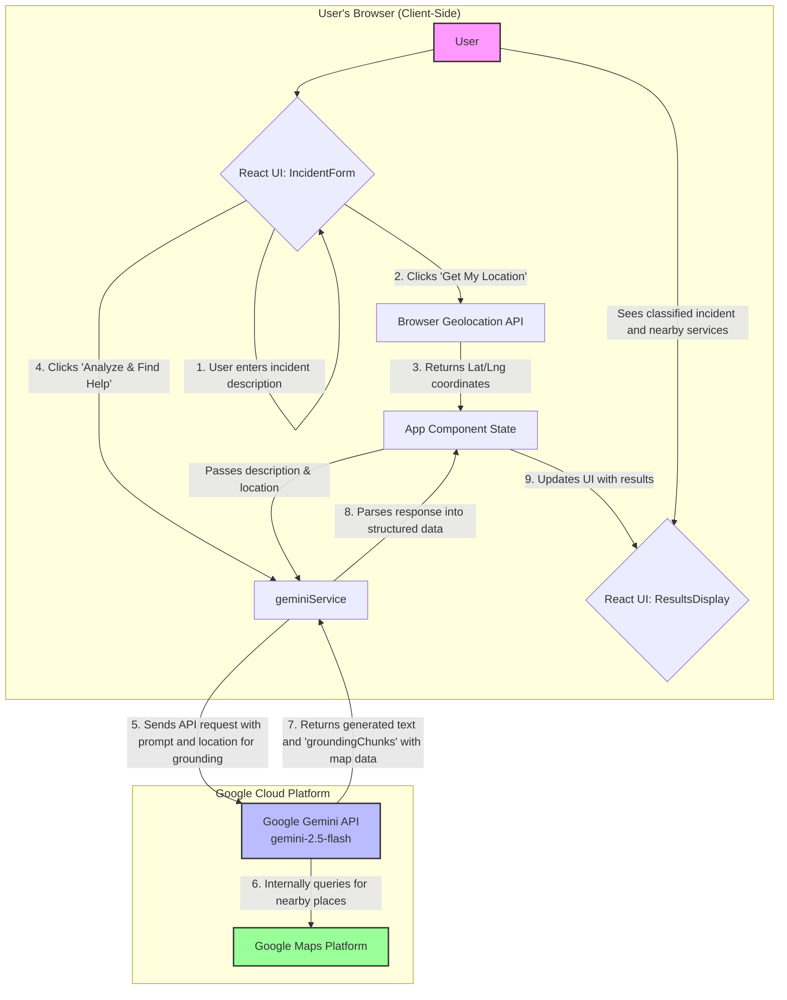

# Run and deploy your AI Studio app

This contains everything you need to run your app locally.

View your app in AI Studio: https://ai.studio/apps/drive/1GvV0sChYtGezXyF8sUyloIFJA07yKCqC

## Run Locally

**Prerequisites:**  Node.js

1. Install dependencies:
   `npm install`
2. Set the `GEMINI_API_KEY` in [.env.local](.env.local) to your Gemini API key
3. Run the app:
   `npm run dev`

# Application Architecture Overview
This application follows a client-side architecture where the user's browser is responsible for all the logic.

**1. Frontend (React Application):** A single-page application built with React and TypeScript. It handles the user interface, state management, and user interactions.  
**2. Browser APIs:** The app directly uses the browser's built-in Geolocation API to securely get the user's current coordinates without sending them to a custom backend server first.  
**3. Google Gemini API:** The core analysis is performed by the Gemini model. The frontend service constructs a detailed prompt containing the user's incident report and sends it directly to the Gemini API.  
**4. Google Maps Grounding:** Instead of making separate calls to the Google Maps Places API, we leverage Gemini's built-in grounding capabilities. By providing the user's coordinates along with the prompt, we instruct Gemini to use Google Maps as a tool to find relevant, real-world emergency services nearby. The API response includes both the AI-generated text and structured data (groundingChunks) containing direct links and information about the places found on Google Maps.  
This serverless, client-side approach is efficient for this proof-of-concept, as it simplifies deployment and reduces infrastructure overhead.  

## Architecture Diagram

